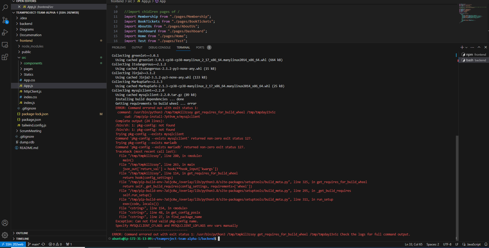

# 🎬 Movie Theater Booking System

> **CMPE-202-1 Class Project - End-to-End Movie Theater Application**  
> **Due: December 1, 2023**

## 📋 Project Overview

Team Alpha's comprehensive Movie Theater Club application - a full-stack solution for managing multiplex theaters across multiple locations. This system provides end-to-end functionality for movie ticket booking, theater management, and user administration.

## 🏗️ System Architecture

The application is built with a modern tech stack featuring:

- **Frontend**: React.js with Tailwind CSS
- **Backend**: Python Flask with RESTful API
- **Database**: MySQL with Redis caching
- **Authentication**: Server-side session tokens with cookies

## ✨ Core Features

### 🎫 User Features

- Movie browsing and scheduling
- Ticket booking with online service fees ($1.50 per ticket)
- Membership management (Regular/Premium)
- User dashboard and purchase history
- Profile management

### 🎭 Theater Management

- Multi-location multiplex support
- Screen and seat management
- Movie scheduling and showtime configuration
- Seat occupancy tracking
- Discount pricing configuration

### 👨‍💼 Administrative Features

- Employee dashboard
- Theater addition and configuration
- Movie management (add/cancel)
- Seat occupancy modifications
- User management and analytics

## 👥 Team Members & Contributions

| Member             | Role               | Key Contributions                                                                                      |
| ------------------ | ------------------ | ------------------------------------------------------------------------------------------------------ |
| **Yifu Fang**      | Project Architect  | Frontend/backend architecture, Dashboard implementation, API integration, Tailwind design improvements |
| **Jiajun Dai**     | Core Developer     | Book Tickets system, Employee scheduling, Database mock data, Film schedules                           |
| **Anthony Zunino** | Backend Developer  | Authentication system, Session management, User queries, Scrum meeting coordination                    |
| **Jena Kelbessa**  | Frontend Developer | User authentication, Login page skeleton, Architecture logistics                                       |

## 🚀 Getting Started

### Prerequisites

- **Python 3.8+**
- **Node.js 16+**
- **MySQL Server**
- **Redis Server**
- **Git**

### Backend Setup

1. **Navigate to backend directory:**

   ```bash
   cd backend
   ```

2. **Create and activate virtual environment:**

   ```bash
   python -m venv venv

   # Windows
   .\venv\Scripts\activate

   # macOS/Linux
   source venv/bin/activate
   ```

3. **Install dependencies:**

   ```bash
   pip install -r requirements.txt
   ```

4. **Configure database:**

   - Update `config.py` with your MySQL credentials:

   ```python
   self.config['MYSQL_USER'] = 'your_username'
   self.config['MYSQL_PASSWORD'] = 'your_password'
   ```

5. **Start the backend server:**
   ```bash
   python app.py
   ```

### Frontend Setup

1. **Navigate to frontend directory:**

   ```bash
   cd frontend
   ```

2. **Install dependencies:**

   ```bash
   npm install
   ```

3. **Start the development server:**
   ```bash
   npm start
   ```

## 🌐 Application Routes

### Public Routes

- **`/`** - Homepage with current movie schedule
- **`/membership`** - Membership options and purchase
- **`/book-tickets`** - Movie ticket booking system
- **`/about-us`** - Theater locations and information

### Authentication Routes

- **`/auth/login`** - User/admin login
- **`/auth/sign-up`** - User registration

### Protected Routes

- **`/dashboard`** - User/employee dashboard (role-based access)

## 📊 System Diagrams

### Class Diagram


### UI Wireframe


### Deployment Status




> **Note**: Frontend successfully deployed to cloud, backend deployment encountered issues

## 🛠️ Development Commands

### Backend Utilities

```bash
# Generate requirements.txt from current environment
pip freeze > requirements.txt

# Deactivate virtual environment
deactivate
```

### Frontend Development

```bash
# Install new dependencies
npm install package-name

# Build for production
npm run build
```

## 📁 Project Structure

```
teamproject-team-alpha-1/
├── backend/                 # Flask backend application
│   ├── controllers/        # Business logic controllers
│   ├── models/            # Database models
│   ├── routes/            # API endpoints
│   └── config.py          # Configuration settings
├── frontend/              # React frontend application
│   ├── components/        # Reusable UI components
│   ├── pages/            # Application pages
│   └── src/              # Source code
├── Diagrams/              # System diagrams and wireframes
└── Documentation/         # Project documentation
```

## 🔗 Important Links

- **GitHub Repository**: [teamproject-team-alpha-1](https://github.com/gopinathsjsu/teamproject-team-alpha-1)
- **Project Journal**: [TeamAlphaProjectJournal.pdf](./ScrumMeeting/TeamAlphaProjectJournal.pdf)
- **Course Syllabus**: [CMPE-202-1](https://sjsu.instructure.com/courses/1570055/files/74025430?wrap=1)
- **Team Information**: [Google Sheets](https://docs.google.com/spreadsheets/1qowXku9R0LjOND2gilTmbdbIUMP-fOhZU7j70APLi4w/edit#gid=0)

## 📚 Course Information

- **Instructor**: Gopinath Vinodh
- **Classroom**: ENG 325
- **Course**: CMPE-202-1
- **Project Type**: End-to-End Application Development

## 🤝 Contributing

This project was developed as part of CMPE-202-1 coursework. For questions or contributions, please contact the team members listed above.

## 📄 License

This project is developed for educational purposes as part of San Jose State University's CMPE-202-1 course requirements.

---

**Team Alpha** - Building the future of movie theater management, one ticket at a time! 🎬✨
